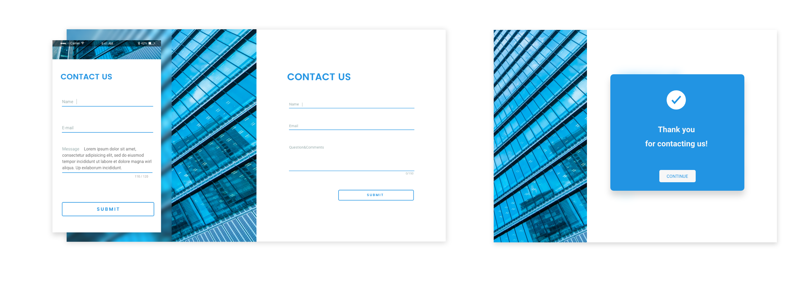

<h1>Contact Us form. React with Formik. REST API</h1>

<p>In my experience, almost every project involves the creation of a form of some kind.  

Here are my steps on how I do that.</p>

<h3>Step 1. Adobe XD</h3>
<p>I start by creating the <a href='https://github.com/irishakarpova/Contact-Us-Form_REST_API/blob/master/layout.xd'>design layout</a> of a form component.</p>

<h3>Step 2. Form in React</h3>
<p>Now, I have a functional component of a form that just returns JSX.</p>

```javaScript
export default () => {
  return(
    <div className='contactForm col-md-10'>
      <h1>CONTACT US</h1>
      <form>
        <div class="form-group col-md-12 p-0">
          <label className='input-lebel'>Name</label>
          <input type="name" className="form-control" />
        </div>
        <div class="form-group col-md-12 p-0">
          <label className='input-lebel'>Email</label>
          <input type="email" className="form-control" />
        </div>
        <div class="form-group">
          <label className='textarea-lebel'>Question&Comments</label>
          <textarea className="form-control" rows="3"></textarea>
        </div>
        <div className="col-md-4 p-0 float-right">
          <button type="submit" className="btn-blue-border">Submit</button>
        </div>
      </form>
    </div>
  )
}

```

<h3>Step 3. Formik</h3>
<p>At this step, I `m going to use the Formik library that helps me to get values out of form state and implement handling form submission.</p>

```javaScript
import { Formik, Form, Field } from "formik"

```

```javaScript
<Formik
  initialValues={{ name: "", email: "", message: "" }}
  onSubmit={props.handleOnSubmit}
  validationSchema={validationSchema}
>
{({ isSubmitting }) => (
  <Form id="cnt-form" noValidate>
    <div className="form-group col-md-12 p-0">
     <label className="input-lebel" htmlFor="name">Name</label>
      <Field data-testid="name" id="name" type="text" name="name" className="form-control" />
      <ErrorMessage data-testid="errors-name" name="name" className="errorMessage" component="div" />
    </div>
    <div className="form-group col-md-12 p-0">
      <label className='input-lebel' htmlFor="email">Email</label>
      <Field data-testid="email" id="email" type="email" name="email" className="form-control" />
      <ErrorMessage data-testid="errors-email" name="email" className="errorMessage" component="div" />
    </div>
    <div className="form-group col-md-12 p-0">
      <label className='textarea-lebel' htmlFor="message">Question&Comments</label>
      <Field data-testid="message"
             id="message"
             name="message"
             component="textarea"
             rows="3"
             className="form-control"
             onKeyUp={handleChange}
        />
      <ErrorMessage data-testid="errors-message" name="message" className="errorMessage" component="div" />
      <p className='counter'>{length}/150</p>
    </div>
    <div className="col-md-4 p-0 float-right">
      <button data-testid="submit-button"
              type="submit"
              className="btn-blue-border"
              disabled={isSubmitting}
      >
       Submit
      </button>
    </div>
  </Form>
)}
</Formik>

```

<p>In addition, I am going to import yup to validate the fields.</p>

```javaScript
import * as Yup from "yup";

const validationSchema = Yup.object().shape({
  name: Yup.string()
    .max(20, 'Too Long')
    .required('Required'),
  email: Yup.string()
    .email('Invalid email')
    .required('Required'),
  message: Yup.string()
    .required("Required")
})

export default validationSchema

```

<h3>Step 4. Axios library</h3>
<p>Axios library for submitting and handling messages.</p>

```javaScript
import axios from "axios"

```


```javaScript

  const handleOnSubmit = (values, actions) => {
    axios({
     method: "POST",
     url: "/api/messages",
     data: values
    })
     .then(response => {
       actions.setSubmitting(false)
       actions.resetForm()
       serverResponse(true, <SuccessMessage handleClickClose={() => setIsOpen(false)}/>)
       setIsOpen(true)
     })
     .catch(error => {
       actions.setSubmitting(false)
       setIsOpen(true)
       serverResponse(false, <WarningMessage handleClickClose={() => setIsOpen(false)}/>)
       actions.resetForm()
     })
  }
  
  ```
  
<h3>Step 5. React Testing Library</h3>

<p>At the end, I use React Testing Library to test my component
I want to make sure Submit Handler Is Being Called.
I also add a couple tests for input validations.</p>


